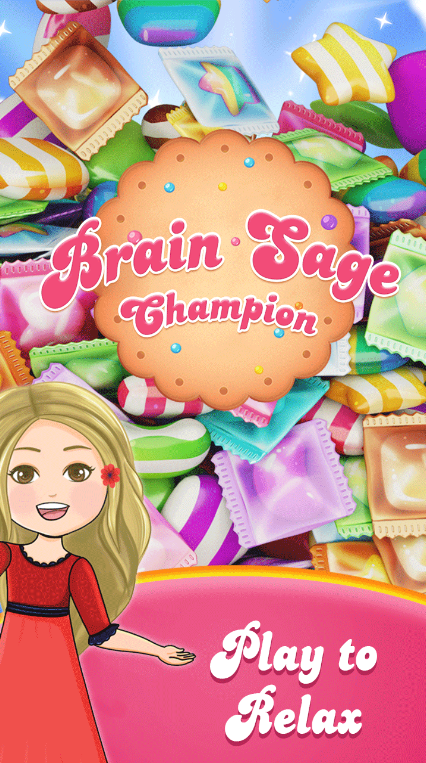
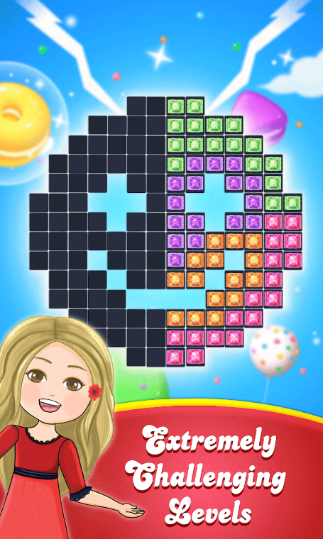
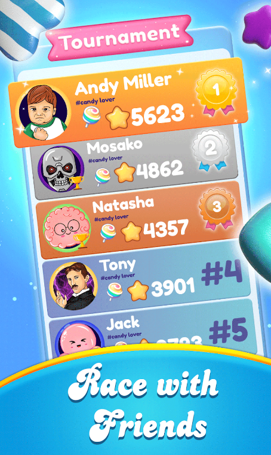
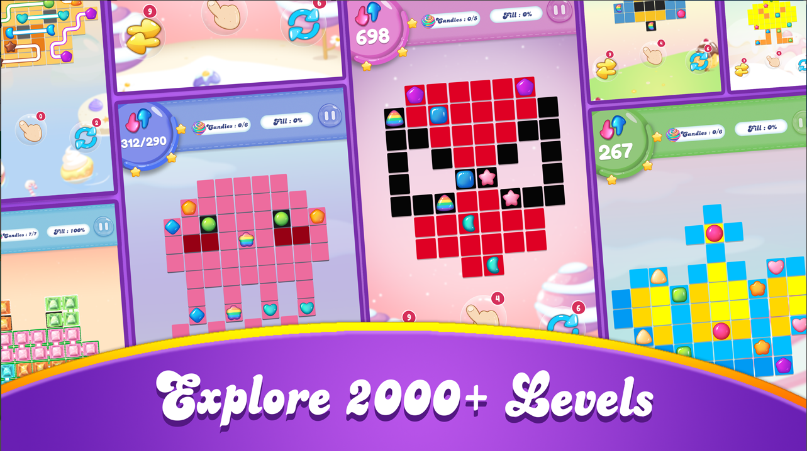

# 🍬 Brain Sage Champion

**Brain Sage Champion** is a free and simple yet captivating game that takes you on a magical journey through the world of colorful candies. Whether you're looking for a relaxing pastime or a thrilling challenge, this game has something for everyone.

## 🌟 Features

- **Addictive Gameplay**: Connect matching candy colors to win. Easy to learn, but hard to master.
- **Thousands of Levels**: Enjoy a wide range of levels from easy and casual to tricky and intense.
- **Time Trial Mode**: Race against the clock to beat your best time.
- **Strategic Challenges**: Solve puzzles with minimal moves to conquer the most difficult levels.
- **Family-Friendly Fun**: Perfect for both adults and kids.

## 🎮 How to Play

1. **Connect Candies**: Link all matching candies with a pipe.
2. **Fill the Board**: Ensure that the entire board is filled without leaving any empty spaces.
3. **Avoid Overlapping**: Pipes cannot overlap, so plan your moves carefully.
4. **Complete the Grid**: Make sure you fill the grid 100% to progress to the next level.

## 🕹️ Game Modes

- **Classic Mode**: Take your time and enjoy the journey at your own pace.
- **Time Trial Mode**: Compete against the clock and improve your reaction time.
- **Challenge Mode**: Solve puzzles in the fewest moves possible.

## 📸 Screenshots

## 🚀 Getting Started

To start playing Brain Sage Champion, simply download the game from Google Play. Get ready to embark on your candy-filled adventure!

### Technologies Used

- HTML - For structuring the content of the website.
- SCSS - For enhanced styling and more maintainable CSS.
- JavaScript - For adding interactivity and dynamic features.
- Swiper - A library used for creating smooth and responsive sliders.
- Animations - Engaging animations added to sections for a more interactive user experience.
The website is fully responsive, designed to work seamlessly on both mobile devices and desktops.

## 🙌 Acknowledgments

Special thanks to all the libraries and tools that made this project possible.

---

Enjoy your magical journey in **Brain Sage Champion**! 🍬✨
